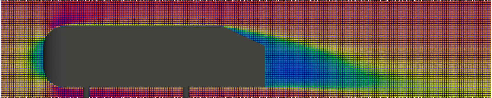

OpenHFDIB-RANS is an OpenFOAM solver based on the hybrid fictitious domain-immersed boundary (HFDIB) method, specifically extended for Reynolds-averaged simulations (RAS) with wall functions at the immersed boundaries.

The initial HFDIB implementation stems from the work of [Federico Municchi](https://github.com/fmuni/openHFDIB). The code was further modified and used in [OpenHFDIB-DEM](https://github.com/techMathGroup/openHFDIB-DEM), which serves as the basis of this solver.

## Requirements
OpenHFDIB-RANS requires [OpenFOAM 8](https://openfoam.org/release/8/) installed on your machine. See the [installation guide](01-Installation) for further details regarding the setup of this library. See the [user guide](02-User-guide) and [tutorials](03-Tutorials) chapters for detailed description of library usage.

## Cite the software as
L. Kubíčková and M. Isoz.: On Reynolds-Averaged Turbulence Modeling with Immersed Boundary Method. In Proceedings of Topical Problems of Fluid Mechanics 2023, Prague, 2023, Edited by David Šimurda and Tomáš Bodnár, pp. 104–111., DOI: https://doi.org/10.14311/TPFM.2023.015

## License
OpenHFDIB-RANS is licensed under the GNU General Public License v3 or later. See http://www.gnu.org/licenses/, for a description of the GNU General Public License terms under which you can copy the files.
